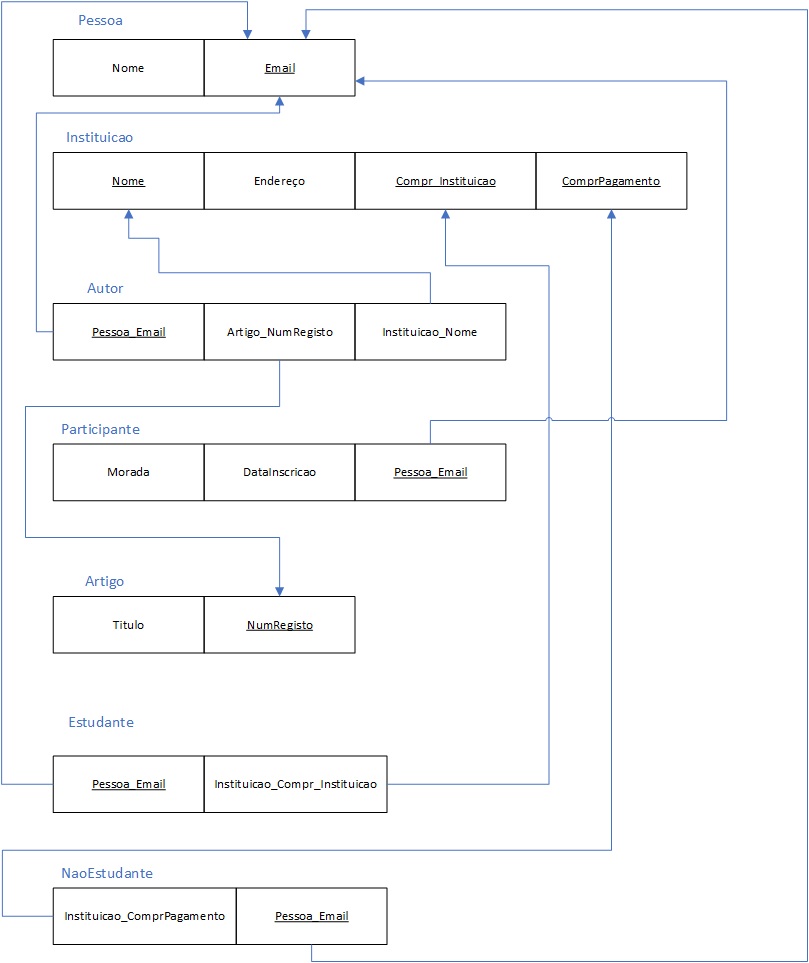

# BD: Guião 3


## ​Problema 3.1
 
### *a)*

```
Cliente: NIF, nome, endereco, num_carta

Aluguer: numero, duracao, data, balcao_numero, veiculo_matricula, cliente_NIF

Balcao: nome, numero, endereco

Veiculo: matricula, marca, ano

Tipo_veiculo: codigo, arcondicionado, designacao

Ligeiro: numLugares, portas, combustivel, codigo_Tipo_veiculo

Pesado: peso, passageiros, codigo_Tipo_veiculo

Similaridade: codigo1, codigo2

_
```


### *b)* 

```
Cliente:
CK(s): NIF, num_carta
PK: NIF
FK(s): -

Aluguer:
CK(s): numero
PK: numero
FK(s): balcao_numero, veiculo_matricula, cliente_NIF_

Balcao:
CK(s): numero
PK: numero
FK(s): -

Veiculo:
CK(s): matricula
PK: matricula
FK(s): codigo_Tipo_veiculo

Tipo_veiculo:
CK(s): codigo
PK: codigo
FK(s): -

Ligeiro:
CK(s): codigo_Tipo_veiculo
PK: codigo_Tipo_veiculo
FK(s): codigo_Tipo_veiculo

Pesado:
CK(s): codigo_Tipo_veiculo
PK: codigo_Tipo_veiculo
FK(s): codigo_Tipo_veiculo

Similaridade:
CK(s): codigo_Tipo_veiculo
PK: codigo1, codigo2
FK(s): codigo_Tipo_veiculo, codigo_Tipo_veiculo


```


### *c)* 


## ​Problema 3.2

### *a)*

```
Airport(Airport_code, City, State, Name)
Airplane_Type(Type_name, Company, Max_seats)
Airplane(Airplane_id, Total_no_of_seats, APType_name)
Flight(Number, Airline, Weekdays)
Flight_Leg(F_number, Leg_no, FAP_code, Scheduled_deptime, Scheduled_arrtime)
Fare(F_number, Code, Amount, Restrictions)
Leg_INSTANCE(FLeg_number, FLeg_no, date, No-of-avaiable-seats, F_APlane_id, AirP_code, Dep_time, Arr_time)
Seat(LeF_number, LeLeg_no, Led_date, Seat_no, Costumer_name, Cphone)
Can_Land(AP_code, APType_name)
```


### *b)* 

```
Airport (Chaves)
    candidatas: Airport_code
    primárias: Airport_code
    estrangeiras: --

Airplane_Type (Chaves)
    candidatas: Type_name, Company
    primárias: Type_name
    estrangeiras: --

Airplane (Chaves)
    candidatas: Airplane_id 
    primárias: Airplane_id
    estrangeiras: APType_name

Flight (Chaves)
    candidatas: Number, Airline
    primárias: Number
    estrangeiras:  --

Flight_Leg (Chaves)
    candidatas: F_number, Leg_no 
    primárias: F_number, Leg_no
    estrangeiras: F_number, FAP_code

Fare (Chaves)
    candidatas: F_number, code
    primárias: F_number, code
    estrangeiras: F_number

Leg_INSTANCE (Chaves)
    candidatas: Fleg_number, FLeg_no, date
    primárias: FLeg_number, FLeg_no
    estrangeiras: FLeg_number, FLeg_no, F_APlane_id, AirP_code

Seat (Chaves)
    candidatas: LeF_number, LeLeg_no, Le_date, Seat_no 
    primárias: LeF_number, LeLeg_no, Le_date, Seat_no
    estrangeiras: LeF_number, LeLeg_no, Le_date

Can_Land (Chaves)
    candidatas: AP_code, APType_name 
    primárias: AP_code, APType_name
    estrangeiras: AP_code, APType_name
```


### *c)* 


## ​Problema 3.3


### *a)* 2.1


### *b)* 2.2


### *c)* 2.3



### *d)* 2.4

